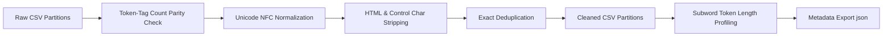
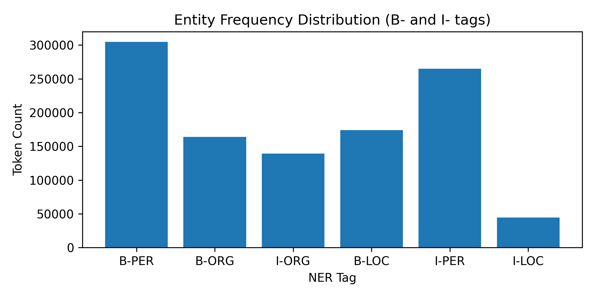
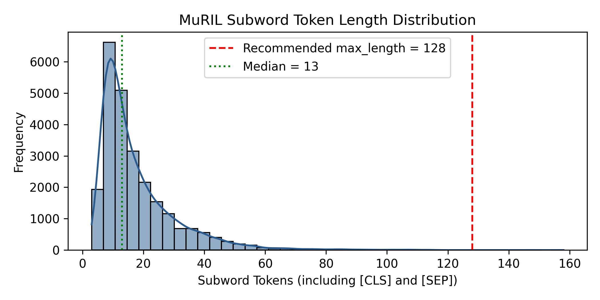

# 🌐 IndicNER: Multilingual Named Entity Recognition for Kannada & Cross-Lingual Transfer

[](https://www.python.org/)
[](https://pytorch.org/)
[](https://huggingface.co/)
[](https://huggingface.co/google/muril-base-cased)
[%20%7C%20Telugu%20(te)-orange)](https://github.com/)
[](LICENSE)

An end-to-end Natural Language Processing (NLP) framework for **Named Entity Recognition (NER)** in **Kannada (`kn`)** with cross-lingual zero-shot evaluation on **Telugu (`te`)**, powered by Google's **MuRIL** (*Multilingual Representations for Indian Languages*) architecture.

---

## 📌 Table of Contents

- [Overview](#-overview)
- [Key Features](#-key-features)
- [Dataset Architecture & Taxonomy](#-dataset-architecture--taxonomy)
- [Data Preprocessing & Quality Engineering](#-data-preprocessing--quality-engineering)
- [Exploratory Data Analysis & Statistics](#-exploratory-data-analysis--statistics)
- [Subword Tokenization & Sequence Length Analysis](#-subword-tokenization--sequence-length-analysis)
- [Repository Structure](#-repository-structure)
- [Installation & Quickstart](#-installation--quickstart)
- [Workflow Pipeline](#-workflow-pipeline)
- [Model Architecture & Subtoken Label Alignment](#-model-architecture--subtoken-label-alignment)
- [Evaluation Protocol](#-evaluation-protocol)
- [License & Acknowledgments](#-license--acknowledgments)

---

## 📖 Overview

Named Entity Recognition (NER) is a core information extraction task that classifies named mentions in unstructured text into predefined semantic categories (e.g., Person, Location, Organization).

Low-resource and morphologically rich languages like **Kannada** pose unique linguistic challenges:
1. **Complex Script & Orthography**: Conjunct consonants (*Ottuakshara*), dependent vowel signs (*matras*), and virama characters.
2. **Agglutinative Morphology**: Extensive affixation that can merge entity roots with grammatical suffixes.
3. **Cross-Lingual Transfer**: Utilizing shared Dravidian morphological structures and multilingual pretrained language models (PLMs) like MuRIL to transfer learned representations across sister languages (e.g., Telugu).

This repository provides a production-grade data curation, normalization, statistical profiling, and transformer tokenization pipeline tailored for Kannada NER.

---

## ✨ Key Features

- 🧹 **Robust Unicode Normalization**: Implements NFC Unicode normalization to maintain orthographic integrity of Kannada ligatures and virama marks while removing HTML tags and non-printable control characters.
- 📐 **Strict Token-Tag Parity Validation**: Guarantees perfect alignment between whitespace-delimited tokens and IOB2 entity tags, filtering malformed records.
- ⚡ **Large-Scale Data Processing**: Efficiently curates over **464,000+ Kannada sentences** containing **4.5+ million tokens**.
- 🔬 **Empirical Sequence Length Profiling**: Performs subword length analysis using `google/muril-base-cased` to determine optimal `max_length` (128 subwords achieves **99.98% sequence coverage**).
- 🔄 **Cross-Lingual Ready**: Includes evaluation benchmarks for **Telugu (`te`)** for zero-shot cross-lingual Dravidian transfer.
- 📊 **Rich Visualizations & Stats**: Persists distribution plots and structured pipeline metadata in `preprocessing_stats.json`.

---

## 🏷️ Dataset Architecture & Taxonomy

The dataset uses the standard **IOB2 (Inside-Outside-Beginning)** tagging scheme covering 3 core entity categories:

| Tag | Entity Class | Description | Example (Kannada) |
| :--- | :--- | :--- | :--- |
| `B-PER` / `I-PER` | **Person** | Names of real or fictional individuals | ಶಿವಗಣೇಶ್ (*Shivaganesh*), ಕುವೆಂಪು (*Kuvempu*) |
| `B-LOC` / `I-LOC` | **Location** | Geographical locations, cities, countries, landmarks | ಬೆಂಗಳೂರು (*Bengaluru*), ಭಾರತ (*India*) |
| `B-ORG` / `I-ORG` | **Organization** | Companies, institutions, government bodies, teams | ಇಸ್ರೋ (*ISRO*), ಕರ್ನಾಟಕ ಸರ್ಕಾರ (*Govt of Karnataka*) |
| `O` | **Outside** | Non-entity / background tokens | ಪುಸ್ತಕ (*book*), ನಿರ್ದೇಶಕರು (*directors*) |

### Data Format

The datasets are structured as two-column CSV files:
- **`tokens`**: Whitespace-separated string of word tokens.
- **`tags`**: Whitespace-separated string of corresponding IOB2 entity tags.

```csv
tokens,tags
ನಿರ್ದೇಶಕರುಃ ಶಿವಗಣೇಶ್,O B-PER
ಬೆಂಗಳೂರಿನಲ್ಲಿ ಇಸ್ರೋ ಕಚೇರಿ ಇದೆ,B-LOC B-ORG I-ORG O
```

---

## ⚙️ Data Preprocessing & Quality Engineering

The preprocessing pipeline in `nlp_act1.ipynb` executes a multi-stage filtering and cleaning process:



### Preprocessing Steps

1. **Token-Tag Length Parity**: Rejects any sentence where `len(tokens.split()) != len(tags.split())`.
2. **NFC Normalization**: Applies `unicodedata.normalize('NFC', token)` to prevent character decomposition while preserving base consonants and conjunct signs.
3. **Noise Filtering**: Cleans residual HTML markup (`<[^>]+>`) and unprintable ASCII control codes (`[\x00-\x1f\x7f-\x9f]`).
4. **Deduplication**: Eliminates duplicate sentences while retaining first occurrences.

### Dataset Split Summary

| Partition | Raw Rows | Cleaned Rows | Retention Rate | Output File |
| :--- | :---: | :---: | :---: | :--- |
| **Kannada Train** (`kn`) | 471,763 | **464,298** | 98.42% | `kn_preprocessed_train.csv` |
| **Kannada Val** (`kn`) | 2,381 | **2,380** | 99.96% | `kn_preprocessed_val.csv` |
| **Kannada Test** (`kn`) | 1,019 | **1,004** | 98.53% | `kn_preprocessed_test.csv` |
| **Telugu Val** (`te`) | 2,700 | **2,700** | 100.0% | `te_val.csv` |
| **Telugu Test** (`te`) | 847 | **847** | 100.0% | `te_test.csv` |

---

## 📊 Exploratory Data Analysis & Statistics

### Cleaned Training Set Token Distribution

The cleaned training split (`kn_preprocessed_train.csv`) contains **4,594,451** total tokens:

| Entity Tag | Category | Token Count | Percentage of Total |
| :--- | :--- | :---: | :---: |
| `O` | Outside (Background) | 3,467,119 | 75.46% |
| `B-PER` | Person (Begin) | 304,572 | 6.63% |
| `I-PER` | Person (Inside) | 265,088 | 5.77% |
| `B-LOC` | Location (Begin) | 173,900 | 3.78% |
| `B-ORG` | Organization (Begin) | 163,833 | 3.57% |
| `I-ORG` | Organization (Inside) | 139,361 | 3.03% |
| `I-LOC` | Location (Inside) | 44,578 | 0.97% |
| **Total Entities** | `B-*` + `I-*` | **1,127,332** | **24.54%** |

```
Entity Breakdown:
  PER (Person)       : 569,660 tokens (50.5% of entities)
  ORG (Organization) : 303,194 tokens (26.9% of entities)
  LOC (Location)     : 218,478 tokens (19.4% of entities)
```



---

## 🔍 Subword Tokenization & Sequence Length Analysis

Indic languages experience significant subword expansion when tokenized with standard subword tokenizers. We analyze sequence expansion using **Google MuRIL** (`google/muril-base-cased`):

```json
{
    "train_rows": 464298,
    "val_rows": 2380,
    "test_rows": 1004,
    "mean_subwords": 17.75,
    "median_subwords": 13,
    "p95_subwords": 43.0,
    "recommended_max_length": 128,
    "coverage_pct": 99.98
}
```

### Key Findings
- **Mean Subword Length**: 17.75 subwords (including `[CLS]` and `[SEP]`).
- **95th Percentile**: 43 subwords.
- **Coverage at `max_length = 128`**: **99.98%** of all training sentences fit completely within 128 tokens without truncation.
- **Recommendation**: Setting `max_length = 128` optimizes GPU memory bandwidth and training throughput while eliminating truncation loss.



---

## 📂 Repository Structure

```text
.
├── nlp_act1.ipynb               # Primary pipeline notebook (Cleaning, EDA, Tokenization)
├── preprocessing_stats.json     # Saved sequence metrics & dataset statistics
├── entity_distribution.png      # Bar chart of entity tag distribution
├── token_length_distribution.png# Histogram & KDE of MuRIL subword lengths
│
├── kn_train.csv                 # Raw Kannada training partition
├── kn_val.csv                   # Raw Kannada validation partition
├── kn_test.csv                  # Raw Kannada test partition
│
├── kn_preprocessed_train.csv    # Cleaned, NFC-normalized Kannada train set
├── kn_preprocessed_val.csv      # Cleaned, NFC-normalized Kannada val set
├── kn_preprocessed_test.csv     # Cleaned, NFC-normalized Kannada test set
│
├── te_val.csv                   # Telugu validation split (Cross-lingual evaluation)
├── te_test.csv                  # Telugu test split (Cross-lingual evaluation)
└── README.md                    # Project documentation
```

---

## 🚀 Installation & Quickstart

### 1. Clone the Repository & Set Up Environment

```bash
git clone https://github.com/your-username/indic-ner-kannada.git
cd indic-ner-kannada

# Create virtual environment
python -m venv .venv

# Activate virtual environment
# On Linux/macOS:
source .venv/bin/activate
# On Windows (PowerShell):
.\.venv\Scripts\Activate.ps1
```

### 2. Install Dependencies

```bash
pip install --upgrade pip
pip install torch transformers datasets seqeval pandas matplotlib seaborn tqdm
```

### 3. Run Preprocessing & Tokenizer Analysis

You can execute the entire pipeline inside `nlp_act1.ipynb` using Jupyter Notebook, VS Code, or Google Colab:

```bash
jupyter notebook nlp_act1.ipynb
```

---

## 🧠 Model Architecture & Subtoken Label Alignment

When fine-tuning pretrained transformer models for Token Classification (NER), words are split into subword pieces. To handle subtoken alignment:

1. The first subword of a token inherits the original token's tag (`B-PER`, `I-ORG`, etc.).
2. Subsequent subwords (*continuation pieces*) can either be masked with `-100` (PyTorch CrossEntropy ignore index) or tagged with the corresponding `I-` tag.
3. Special tokens (`[CLS]`, `[SEP]`, `[PAD]`) are assigned `-100`.

```python
from transformers import AutoTokenizer

tokenizer = AutoTokenizer.from_pretrained("google/muril-base-cased")

def tokenize_and_align_labels(examples, label2id, max_length=128):
    tokenized_inputs = tokenizer(
        examples["tokens"],
        truncation=True,
        is_split_into_words=True,
        max_length=max_length,
        padding="max_length"
    )
    
    labels = []
    for i, label in enumerate(examples["tags"]):
        word_ids = tokenized_inputs.word_ids(batch_index=i)
        previous_word_idx = None
        label_ids = []
        for word_idx in word_ids:
            if word_idx is None:
                label_ids.append(-100) # Special tokens ([CLS], [SEP], [PAD])
            elif word_idx != previous_word_idx:
                label_ids.append(label2id[label[word_idx]]) # First subtoken
            else:
                label_ids.append(-100) # Subsequent subtokens masked from loss
            previous_word_idx = word_idx
        labels.append(label_ids)
        
    tokenized_inputs["labels"] = labels
    return tokenized_inputs
```

---

## 📈 Evaluation Protocol

Standard evaluation is performed using the `seqeval` framework for exact chunk matching (Strict IOB2 evaluation):

$$\text{Precision} = \frac{\text{True Positives}}{\text{Total Predicted Entities}}$$

$$\text{Recall} = \frac{\text{True Positives}}{\text{Total Ground Truth Entities}}$$

$$\text{F1-Score} = 2 \times \frac{\text{Precision} \times \text{Recall}}{\text{Precision} + \text{Recall}}$$

### Evaluation Scenarios
1. **In-Language Evaluation**: Train on `kn_preprocessed_train.csv`, evaluate on `kn_preprocessed_test.csv`.
2. **Zero-Shot Cross-Lingual Transfer**: Evaluate the Kannada-trained model directly on Telugu (`te_test.csv`) without Telugu fine-tuning.

---

## 📜 Citation & References

If you use this repository or datasets in your research, please cite the following foundational works:

```bibtex
@inproceedings{khanuja2021muril,
  title={MuRIL: Multilingual Representations for Indian Languages},
  author={Khanuja, Simran and Bansal, Diksha and Mehtani, Sarvesh and Savle, Savya and Verma, Sangpreet and J, Niranjan and S, Senthil and K, Madhumita and S, Sairam and N, Sankar and others},
  booktitle={arXiv preprint arXiv:2103.10730},
  year={2021}
}
```

---

## 🤝 Contributing

Contributions, issues, and feature requests are welcome! Feel free to open an issue or submit a Pull Request.

---

## 📄 License

This project is licensed under the **MIT License** - see the [LICENSE](LICENSE) file for details.
